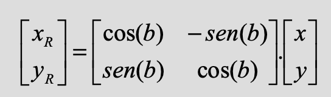
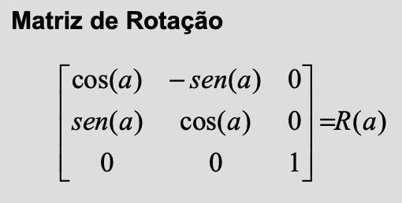
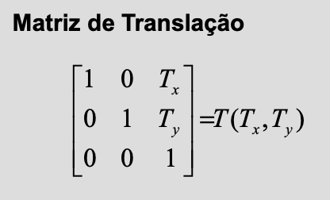
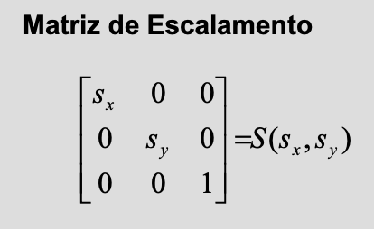

# Semana 2 - Transformaçoes Geométricas
## 2D
### Tranlação 
Aplica-se a cada vertice um deslocamento por vector de translaçao 
### Escalamento 
Multiplica-se a cada vertice por um vector
por exemple um segmento de reta que vai de (20,0) a (40, 100) um por escalar de 2 ficara (40, 0) a (80,200)
### Rotaçao 
É aplicada a um objeto com o angulo no sentido oposto ao dos ponteiros do relogio,
Na forma matrixial 

### Composiçao de Transformaçoes
As transformaçoes nao são operaçoes cumulativas, isto é a ordem com que se aplicam as transformaçoes vai infloenciar o resultado final.

### Cordenadas Homogeneas
Nos podemos produzir as transformaçoes de forma matrixial, neste tipo de coordenadas homogeneas um objecto de n dimensoes será representado por um espaço de n+1 dimensoes.
as respetivas transformaçoes:
- Rotação:

- Translation:

- Scaling:

# Semana 3 - Cor e Iluminação

## Conversion between HSV <-> RGB:
Make a conversion betwenn the H angle the the corresponding colors
The V value corresponds to the percentage of the range that the max color can accomplish, ex: if the V=50º and R is the brightes then R=128
Last the S represents the diference between the max and lowest bright colors, ex: S=50% then if the max is 128 then the lowest will be 128-(0.5*128) -> 64

## Conversions between RGB <-> CMY:
As cores são o inverso na ordem indica entao R=1-C, G=1-M e B=1-y

## Modelos de Iluminaçao 

### Iluminaçao ambiente
Esta é a luz sempre presente
I = Ka+Ia 
Ka -> coeficiente de refleçao difusa
Ia -> intensidade

### Refeçao Difusa
I = (Kd * Ip * cos(o)) / d**2 
Kd -> coeficiente de refleçao difusa
Ip -> intensidade 
d -> distancia 
o -> angulo entre o raio de insisao e a normal da superficie

### Reflexão Especular/Modelo de Phong
I = (Kd * Ip * (cos(o))**n) / d**2
the same as before but the n now represents specular exponent (shininess)
o-> representa a diferenca entre o raio de insisao e o observador

the d is only use when there are no attenuation

## Shading and Smooth Shading

Sombreamento Constante: 
Aplicar a mestma cor, lux a mesma superficie

### Sombreamento Interpolado:
Metodo de Gouraud:
1. Calcular a cor de cada vertice atraves do modelo de iluminaçao pretendido 
2. Calcular o resto das cores atraves the interpolaçao bi-linear

Metodo de Phong:
1. Para cada vertice calcula-se o vetor normal à superficie
2. As normais nas arestas são calculadas por intepolaçao linear das normais nos vertices. O modelo de iluminaçao local é aplicado em cada ponto 

O problema é que o resultado depende da orientaçao do polígono 
:
## Texturas
Tipos:
* Mapeamento de Texturas(imagens 2D)
* Bump Mapping Textures
* Texturas 3D 
